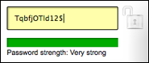

StrongPass.js
==============

A basic plugin that can do `scoring` of password strength as a user types within an input field.



See it live in action on this jsfiddle [here](http://jsfiddle.net/dimitar/n8Dza/) or [this one](http://jsfiddle.net/dimitar/nZn6A/).

[](http://coderwall.com/dimitarchristoff)


How to use
----------

Get MooTools (1.4.5 ideally). No -more required. Have a password field and some CSS.

```html

    <input type="password" id="foo" />
```

```css

    div.pass-container {
        height: 30px;
    }

    div.pass-bar {
        height: 11px;
        margin-top: 2px;
    }
    div.pass-hint {
        font-family: arial;
        font-size: 11px;
    }
```

Create your instance

```javascript

    new StrongPass("foo", {
        onReady: function() {
            console.log('you can begin typing');
        },
        onPass: function(score, verdict) {
            console.log('pass', score, verdict)
        },
        onFail: function(score, verdict) {
            console.log('fail', score, verdict);
        },
        onBanned: function(word) {
            console.warn(word, 'is not allowed as it is on the bannedPasswords list');
        }
    });
```

Alternatively, you can just use it as a tool to check and feed back scores without output - so you can script your own via the events instead.

```javascript

    var indicator = document.getElement('span.pwStrengthResult'),
        colourIndicate = function(level, label) {
            indicator.set({
                html: label,
                styles: {
                    color: this.options.colors[level] || this.options.colors.getLast()
                }
            })
        }

    new StrongPass('foo', {
        bannedPass: 'Very weak (too common)',
        verdicts: [
            'Too Short',
            'Weak',
            'Good',
            'Strong'
        ],
        colors: [
            '#777',
            '#900',
            '#070',
            '#0c0'
        ],
        // tweak scores here
        scores: [
            10,
            30,
            40,
            100
        ],
        render: false,
        onPass: function() {
            colourIndicate.apply(this, arguments);
        },
        onFail: function() {
            colourIndicate.apply(this, arguments);
        }
    });
```

How it works
------------

A series of tests and definitions dictate the total `scoring` of the string in the input (or an arbitrary string) as a password. Certain logic is applied to do with best practices that helps in the scoring. In terms of configuration of how lax the plugin is, you can use several things.

- `options` - can set `scores` as ranges that map to verdicts. In the example above, anything scoring below 10 will be deemed `Too short`, between 10 and 30 - `Weak` and so forth. By upping these values, you can make it more demanding - or less demanding, dependent on what your users are like.
- `length` - there are some extra bonuses added for each extra character over the minimum length as the longer a password is, the more time it will take to brute force. The values added here are somewhat arbitrary but you can edit the `checkPassword` method and set your own values.
- `regex scoring` - the class has a static array of simple objects that looks like this:

```javascript

    checks: [
        /* alphaLower */ {
            re: /[a-z]/,
            score: 1
        },
        /* alphaUpper */ {
            re: /[A-Z]/,
            score: 5
        },
        /* mixture of upper and lowercase */ {
            re: /([a-z].*[A-Z])|([A-Z].*[a-z])/,
            score: 2
        },
        /* threeNumbers */ {
            re: /(.*[0-9].*[0-9].*[0-9])/,
            score: 7
        },
        /* special chars */ {
            re: /.[!@#$%^&*?_~]/,
            score: 5
        },
        /* multiple special chars */ {
            re: /(.*[!@#$%^&*?_~].*[!@#$%^&*?_~])/,
            score: 7
        },
        /* all together now, does it look nice? */ {
            re: /([a-zA-Z0-9].*[!@#$%^&*?_~])|([!@#$%^&*?_~].*[a-zA-Z0-9])/,
            score: 3
        },
        /* password of a single char sucks */ {
            re: /(.)\1+$/,
            score: 2
        }
    ],
```

You can add / push to this array to add further changes or you can edit the regex or the scoring applied. A score can also be negative. For instance, we add `2` bonus points if the password has more than 1 letter so it's not just something like `aaaaaa` to make it pass. This is a 'positive' score that awards variety but you can easily reverse the check and the result of the regex to a penalising one by doing:

    /* password of a single char sucks A LOT */ {
        re: /^(.)\1+$/,
        score: -20
    }


Tests
-----

Via Buster.js, go to `test/index.html` to run.

You can also test via node. To install buster:

    # npm install -g buster
    
To start the static tester:    
    
    # buster static
    
To start in capture mode for multiple browsers:

    # buster server &

Once you have captured your target browsers, just run:

    # buster test

More details on testing in `the tests/README.md`, including examples.

License
-------

Licensed under the MIT License. You are not allowed to [use for evil](http://www.youtube.com/watch?v=-hCimLnIsDA)
